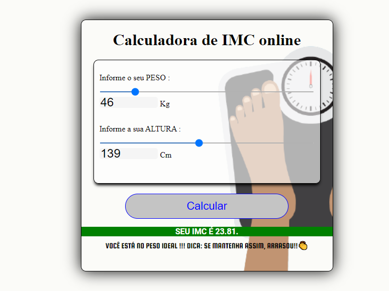
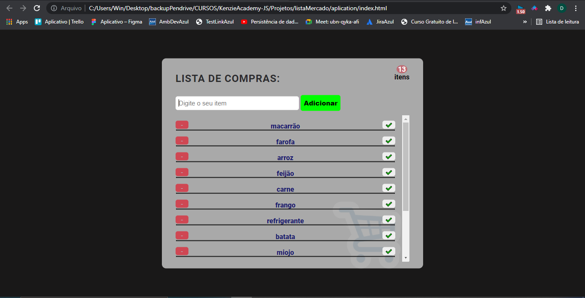

# KenzieAcademy-JS
Kenzie Academy  - edição Semana JS

Durante a semana foi passado conhecimentos de HTML, CSS e JS, montando duas aplicações utilizando as mesmas.

Segue as fotos.

### Link da aplicação calculadora de IMC : 

https://app.netlify.com/sites/pedantic-austin-4701ac/overview

### Link da aplicação Lista de compras : 

https://trusting-ritchie-76c62c.netlify.app/

