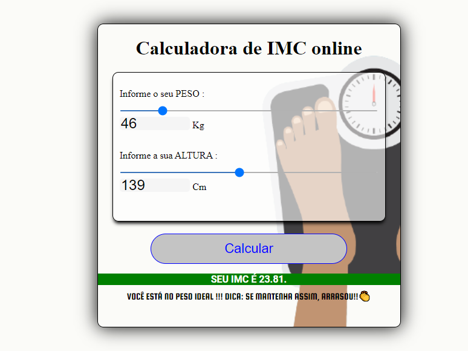

# Calculadora de IMC - Kenzie Academy

## Projeto realizado na semana JS da Kenzie Academy.

### Foram utilizadas as tecnologias:

1. HTML
    - Esqueleto da aplicação,separação dos elementos.
2. CSS
    - Estilização dos elementos na tela,cores,posição,animação.
3. JavaSCript (JS)
    - Atualição do conteúdo.
   
### Apliquei essass funcionalidades extras : 
 - Adicionei background de acordo com o resultado do IMC;
 - O valor do input range(slider) está passando para o input type number e vice-versa;
 - Validação de quando o valor for 0; 

### Visão Geral:

